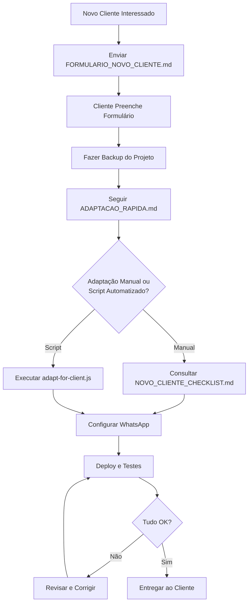

# 📚 Índice: Adaptação do Projeto para Novos Clientes

> **Sistema de Gestão de Convênios - Mais Saúde LASAC**  
> Documentação para reaproveitamento em novos clientes

---

## 🎯 Por onde começar?

### 🚀 **Primeira vez adaptando?**
👉 Comece por: **[ADAPTACAO_RAPIDA.md](./ADAPTACAO_RAPIDA.md)**

Guia prático de 5 passos com tempo estimado de 3h30min

---

### 📋 **Precisa de uma lista completa?**
👉 Consulte: **[NOVO_CLIENTE_CHECKLIST.md](./NOVO_CLIENTE_CHECKLIST.md)**

Checklist detalhado com:
- ✅ Tudo que precisa alterar
- ✅ Informações a solicitar
- ✅ Configurações técnicas
- ✅ Testes e validações

---

### 📝 **Vai coletar informações do cliente?**
👉 Envie: **[FORMULARIO_NOVO_CLIENTE.md](./FORMULARIO_NOVO_CLIENTE.md)**

Formulário estruturado para o cliente preencher com:
- Dados da empresa
- WhatsApp Business (tokens, templates)
- Regras de negócio
- Branding (logo, cores)

---

### 🤖 **Quer automatizar substituições?**
👉 Execute: **[scripts/adapt-for-client.js](./scripts/adapt-for-client.js)**

Script Node.js que automatiza:
- Substituição de nomes (LASAC → Novo Cliente)
- Substituição de textos em massa
- Geração de log de alterações

```bash
# Como usar:
node scripts/adapt-for-client.js
```

---

## 📖 Fluxo Recomendado



---

## 📂 Estrutura de Documentos

```
📁 mais-saude-lasac/
│
├── 📘 INDICE_ADAPTACAO.md           ← Você está aqui!
│
├── 📗 ADAPTACAO_RAPIDA.md           ← ⭐ Guia rápido (3h30min)
│   ├── 5 passos essenciais
│   ├── Comandos prontos
│   └── Troubleshooting
│
├── 📙 NOVO_CLIENTE_CHECKLIST.md     ← ⭐ Checklist completo
│   ├── O que solicitar ao cliente
│   ├── O que alterar no código
│   ├── Deploy e configuração
│   └── Entrega e manutenção
│
├── 📝 FORMULARIO_NOVO_CLIENTE.md    ← ⭐ Enviar ao cliente
│   ├── Dados da empresa
│   ├── WhatsApp Business
│   ├── Branding e identidade
│   └── Regras de negócio
│
├── 🤖 scripts/adapt-for-client.js   ← ⭐ Automação
│   └── Substituições em massa
│
└── 📚 Outros documentos úteis
    ├── MANUAL_DO_USUARIO.md
    ├── FAQ.md
    ├── WHATSAPP_TEMPLATES.md
    └── GUIA_RAPIDO.md
```

---

## ⚡ Quick Start

### 1. Preparação (5 min)
```bash
# Clonar projeto
git clone repo projeto-novo-cliente
cd projeto-novo-cliente

# Criar branch
git checkout -b cliente/nome-empresa

# Fazer backup
cp -r . ../backup-original
```

---

### 2. Coletar Informações (1 dia)
```bash
# Enviar ao cliente:
FORMULARIO_NOVO_CLIENTE.md

# Aguardar preenchimento + anexos (logo, etc)
```

---

### 3. Adaptar Projeto (3-4 horas)
```bash
# Opção A: Script automatizado
node scripts/adapt-for-client.js

# Opção B: Manual
# Seguir: ADAPTACAO_RAPIDA.md ou NOVO_CLIENTE_CHECKLIST.md
```

---

### 4. Deploy (1 hora)
```bash
# Vercel (recomendado)
vercel --prod

# Ou VPS
ssh user@servidor
npm run build
pm2 start npm -- start
```

---

### 5. Testes (30 min)
```bash
# Seguir checklist em ADAPTACAO_RAPIDA.md > TESTES
```

---

## 🎯 Casos de Uso

### 📌 **"Cliente enviou formulário preenchido"**
➜ Siga: [ADAPTACAO_RAPIDA.md](./ADAPTACAO_RAPIDA.md)  
**Tempo:** 3h30min

---

### 📌 **"Cliente quer customizações complexas"**
➜ Consulte: [NOVO_CLIENTE_CHECKLIST.md](./NOVO_CLIENTE_CHECKLIST.md)  
**Tempo:** Variável (6-20 horas)

---

### 📌 **"Cliente ainda não enviou informações"**
➜ Envie: [FORMULARIO_NOVO_CLIENTE.md](./FORMULARIO_NOVO_CLIENTE.md)  
**Tempo:** 1 dia de espera

---

### 📌 **"Preciso adaptar rápido (urgência)"**
➜ Execute: `node scripts/adapt-for-client.js`  
➜ Depois: [ADAPTACAO_RAPIDA.md](./ADAPTACAO_RAPIDA.md) - Seção "5 Passos Essenciais"  
**Tempo:** 2 horas

---

## 📊 Estimativa de Tempo por Cenário

| Cenário | Tempo Total | Complexidade |
|---------|-------------|--------------|
| **Cliente Padrão** (sem customizações) | 3-4h | ⭐ Baixa |
| **Cliente com Branding Customizado** | 5-8h | ⭐⭐ Média |
| **Cliente com Regras Específicas** | 8-12h | ⭐⭐⭐ Alta |
| **Cliente Multi-Unidade/Complexo** | 16-40h | ⭐⭐⭐⭐ Muito Alta |

---

## ✅ Checklist Rápido

Antes de entregar ao cliente, confirme:

- [ ] **Ambiente**
  - [ ] `.env` configurado com dados do cliente
  - [ ] Banco de dados criado e migrado
  - [ ] Secrets gerados (BETTER_AUTH_SECRET, CRON_SECRET)

- [ ] **Branding**
  - [ ] Logo substituído
  - [ ] Cores atualizadas
  - [ ] Nome da empresa em todos os lugares

- [ ] **WhatsApp**
  - [ ] Templates configurados
  - [ ] Tokens validados
  - [ ] Teste de envio realizado

- [ ] **Deploy**
  - [ ] Aplicação rodando em produção
  - [ ] SSL configurado (HTTPS)
  - [ ] Cron job agendado

- [ ] **Testes**
  - [ ] Login funciona
  - [ ] Cadastro de paciente funciona
  - [ ] WhatsApp está enviando
  - [ ] Cron executa corretamente

- [ ] **Documentação**
  - [ ] Credenciais documentadas
  - [ ] Manual do usuário entregue
  - [ ] Contatos de suporte definidos

---

## 🆘 Problemas Comuns

### ❓ "Não sei qual documento consultar"
**R:** Comece por [ADAPTACAO_RAPIDA.md](./ADAPTACAO_RAPIDA.md) - ele tem links para os outros

---

### ❓ "Cliente não tem WhatsApp Business API"
**R:** [NOVO_CLIENTE_CHECKLIST.md](./NOVO_CLIENTE_CHECKLIST.md) > Seção "1. INFORMAÇÕES A SOLICITAR" > "WhatsApp Business API"  
Inclui passo a passo para criar conta Meta Business

---

### ❓ "Script adapt-for-client.js não funciona"
**R:** Certifique-se de:
1. Estar na raiz do projeto
2. Ter Node.js instalado
3. Ter feito backup antes
4. Executar: `node scripts/adapt-for-client.js`

---

### ❓ "Deploy deu erro"
**R:** [ADAPTACAO_RAPIDA.md](./ADAPTACAO_RAPIDA.md) > Seção "TROUBLESHOOTING RÁPIDO"

---

## 📞 Suporte

- 📧 Email: [seu-email@empresa.com]
- 💬 WhatsApp: [seu-numero]
- 📚 Documentação: [link-docs]

---

## 🔄 Histórico de Versões

| Versão | Data | Mudanças |
|--------|------|----------|
| 1.0 | Jan/2026 | Versão inicial da documentação |

---

## 📝 Contribuindo

Encontrou algo para melhorar? 

1. Documente a melhoria
2. Atualize os arquivos relevantes
3. Atualize este índice
4. Incremente a versão

---

**🎯 Dica Final:** Marque este arquivo (`INDICE_ADAPTACAO.md`) como favorito!  
Ele é seu ponto de partida para qualquer adaptação.

---

**Criado por:** [Seu Nome/Empresa]  
**Última atualização:** Janeiro 2026  
**Licença:** [Sua Licença]


